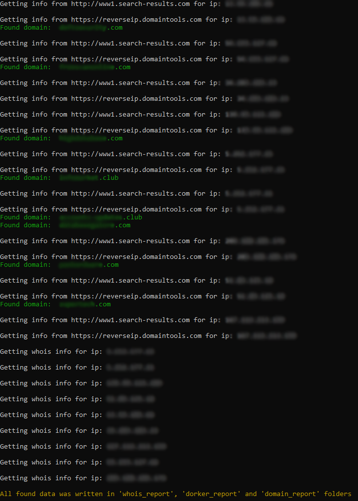

# IP Informator

```
Choose one of four modes:

python3 ipinfo.py -f file_with_ip.txt -m dork
python3 ipinfo.py -f file_with_ip.txt -m whois
python3 ipinfo.py -f file_with_ip.txt -m domain
python3 ipinfo.py -f file_with_ip.txt -m all

Default values:

-f - ip_list.txt
-m - all

Use python3 ipinfo.py -m help to see this message
```


